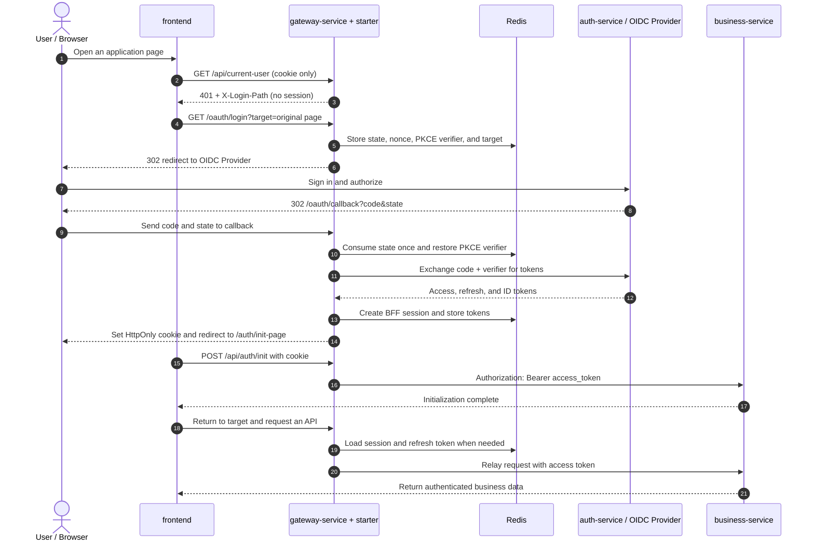

# Spring Gateway OAuth2/OIDC Client Starter

**Language:** [English](README.md) | [简体中文](README.zh-CN.md)

A Spring Boot starter that turns Spring Cloud Gateway into an OAuth2/OIDC BFF. It handles Authorization Code + PKCE login, server-side sessions, token refresh, logout, and access-token relay so the frontend only works with an HttpOnly cookie.

## Architecture and Login Flow



The browser holds only a random session ID. Login context, tokens, and refresh locks stay in the Gateway and Redis; business services receive and validate only the access token.

## Highlights

- Keeps access tokens, refresh tokens, ID tokens, client secrets, and PKCE verifiers on the server.
- Stores authorization requests and BFF sessions in Redis.
- Validates OIDC `state` and `nonce`, with one-time callback consumption.
- Refreshes access tokens with a Redis-backed distributed lock.
- Relays access tokens through the standard `Authorization: Bearer` header.
- Integrates as a reusable starter with fail-fast configuration validation.
- Supports dynamic callback origins for approved browser-facing hosts.

## Project Structure

```text
frontend/                              React + Vite demo
backend/
  auth-service/                        Local OIDC provider
  gateway-service/                     Spring Cloud Gateway BFF demo
  oauth-oidc-client-starter/           Reusable starter
  business-service/                    Resource Server demo
```

| Component | Responsibility |
| --- | --- |
| `frontend` | Renders the UI, calls Gateway APIs with cookies, and follows `X-Login-Path` to start login. |
| `gateway-service` | Hosts the starter and configures browser entry points, downstream routes, and OIDC settings. |
| `oauth-oidc-client-starter` | Implements PKCE login, callback validation, BFF sessions, refresh, logout, and token relay. |
| `Redis` | Stores one-time authorization requests, BFF sessions, token data, and distributed refresh locks. |
| `auth-service` | Local OIDC Provider that authenticates users and issues or refreshes tokens. |
| `business-service` | Spring Security Resource Server that validates access tokens and serves business APIs. |

## Use in a Gateway

### 1. Add the dependency

The artifact is published on GitHub Packages, which requires a GitHub token with `read:packages` permission.

```gradle
repositories {
    mavenCentral()
    maven {
        url = uri("https://maven.pkg.github.com/iamxiaozhuang/oauth-oidc-client-starter")
        credentials {
            username = findProperty("gpr.user") ?: System.getenv("GITHUB_ACTOR")
            password = findProperty("gpr.key") ?: System.getenv("GITHUB_TOKEN")
        }
    }
}

dependencies {
    implementation "io.github.oidcclient:oauth-oidc-client-starter:1.0.3"
    implementation "org.springframework.cloud:spring-cloud-starter-gateway-server-webflux"
    implementation "org.springframework.boot:spring-boot-starter-security"
}
```

### 2. Configure Redis, routing, and OIDC

```yaml
spring:
  main:
    web-application-type: reactive
  data:
    redis:
      url: redis://localhost:6379
  cloud:
    gateway:
      server:
        webflux:
          routes:
            - id: business-service
              uri: http://localhost:8081
              predicates:
                - Path=/api/**

oauth-oidc-client:
  authorization-endpoint: https://id.example.com/oauth2/authorize
  token-endpoint: https://id.example.com/oauth2/token
  client-id: gateway-client
  client-secret: ${OAUTH_OIDC_CLIENT_SECRET}
  callback-path: /oauth/callback
  login-success-path: /auth/init-page
  logout-success-path: /logout
  allowed-redirect-hosts:
    - app.example.com
  protected-path-prefixes:
    - /api/
  public-path-prefixes:
    - /oauth/
  secure-cookie: true
  same-site: Lax
  redis-session-ttl: 12h
```

Register `https://app.example.com/oauth/callback` with the OIDC provider. The current release uses explicit authorization and token endpoints.

### Configuration Reference

| Property | Purpose |
| --- | --- |
| `spring.data.redis.url` | Redis connection used by the Gateway. |
| `spring.cloud.gateway...routes` | Routes browser API requests to downstream services. |
| `authorization-endpoint` | Authorization URL used to start login. |
| `token-endpoint` | URL used to exchange the authorization code and refresh tokens. |
| `client-id` / `client-secret` | Gateway client credentials registered with the OIDC Provider. |
| `callback-path` | Gateway path to which the OIDC Provider returns the browser. |
| `login-success-path` | Initialization page opened after a successful callback. |
| `logout-success-path` | Destination after clearing the cookie and server-side session. |
| `allowed-redirect-hosts` | Allowlist of browser-facing hosts that may receive callbacks. |
| `protected-path-prefixes` | Paths that require a BFF session and receive token relay. |
| `public-path-prefixes` | Anonymous paths such as login and callback endpoints. |
| `secure-cookie` / `same-site` | HTTPS and cross-site behavior of the session cookie. |
| `redis-session-ttl` | Lifetime of a BFF session in Redis. |

### 3. Use the BFF contract

Let Spring Security permit Gateway traffic; the starter filter enforces the BFF session on protected paths.

```java
@Bean
SecurityWebFilterChain securityWebFilterChain(ServerHttpSecurity http) {
    return http
            .csrf(ServerHttpSecurity.CsrfSpec::disable)
            .authorizeExchange(exchange -> exchange.anyExchange().permitAll())
            .build();
}
```

The frontend calls Gateway APIs with cookies:

```ts
await fetch('/api/current-user', { credentials: 'include' });
```

Downstream services remain standard Spring Security Resource Servers and validate the access token relayed by the Gateway.

## Run the Local Demo

Requirements: Java 21, Node.js, npm, and Redis on `localhost:6379`.

Build everything:

```powershell
cd backend
.\gradlew.bat clean build --no-daemon

cd ..\frontend
npm install
npm run build
```

Start Redis, then run these commands in separate terminals:

```powershell
cd backend
.\gradlew.bat :auth-service:bootRun
.\gradlew.bat :business-service:bootRun
.\gradlew.bat :gateway-service:bootRun
```

```powershell
cd frontend
npm run dev
```

Open `http://localhost:5173` and sign in with `user` / `password`.

| Service | Address |
| --- | --- |
| Frontend | `http://localhost:5173` |
| Gateway | `http://localhost:8080` |
| Business service | `http://localhost:8081` |
| Auth service | `http://localhost:9000` |
| Redis | `localhost:6379` |

More backend details are available in [backend/README.md](backend/README.md).
