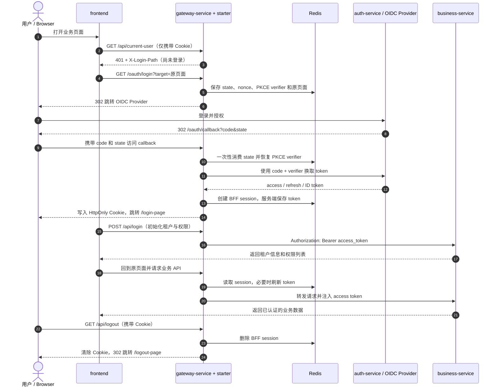

# Spring Gateway OAuth2/OIDC Client Starter

**语言：** [English](README.md) | [简体中文](README.zh-CN.md)

一个让 Spring Cloud Gateway 具备 OAuth2/OIDC BFF 能力的 Spring Boot Starter。它统一处理 Authorization Code + PKCE 登录、服务端会话、token 刷新、退出登录和 access token 透传，让前端只需要使用 HttpOnly Cookie。

## 架构与登录流程



浏览器始终只持有随机 session ID。登录上下文、token 和刷新锁都保存在 Gateway 服务端与 Redis 中；业务服务只接收并验证 access token。

## 核心优势

- access token、refresh token、ID token、client secret 和 PKCE verifier 全部保留在服务端。
- authorization request 和 BFF session 使用 Redis 存储。
- 校验 OIDC `state` 与 `nonce`，callback 只能消费一次。
- 使用 Redis 分布式锁协调 access token 刷新。
- 通过标准 `Authorization: Bearer` 请求头向下游服务传递身份。
- 以 Starter 方式接入，并提供启动时配置校验。
- 支持经过白名单校验的动态 callback 域名。

## 项目结构

```text
frontend/                              React + Vite 示例前端
backend/
  auth-service/                        本地 OIDC Provider
  gateway-service/                     Spring Cloud Gateway BFF 示例
  oauth-oidc-client-starter/           可复用 Starter
  business-service/                    Resource Server 示例
```

| 模块 | 作用 |
| --- | --- |
| `frontend` | 提供业务首页、`/login-page` 登录初始化页和 `/logout-page` 退出成功页，通过 Cookie 调用 Gateway API。 |
| `gateway-service` | Starter 的运行宿主，配置浏览器入口、下游路由和 OIDC 参数。 |
| `oauth-oidc-client-starter` | 实现 PKCE 登录、callback 校验、BFF session、token 刷新、退出和 token relay。 |
| `Redis` | 保存一次性授权请求、BFF session、token 信息和分布式刷新锁。 |
| `auth-service` | 本地 OIDC Provider，负责用户登录、签发和刷新 token。 |
| `business-service` | Spring Security Resource Server，验证 access token，并通过 `/api/login` 初始化示例租户与业务权限。 |

## 标准使用方式

### 1. 添加依赖

Artifact 发布在 GitHub Packages，下载时需要具备 `read:packages` 权限的 GitHub Token。

```gradle
repositories {
    mavenCentral()
    maven {
        url = uri("https://maven.pkg.github.com/iamxiaozhuang/oauth-oidc-client-starter")
        credentials {
            username = findProperty("gpr.user") ?: System.getenv("GITHUB_ACTOR")
            password = findProperty("gpr.key") ?: System.getenv("GITHUB_TOKEN")
        }
    }
}

dependencies {
    implementation "io.github.oidcclient:oauth-oidc-client-starter:1.0.3"
    implementation "org.springframework.cloud:spring-cloud-starter-gateway-server-webflux"
    implementation "org.springframework.boot:spring-boot-starter-security"
}
```

### 2. 配置 Redis、路由和 OIDC

```yaml
spring:
  main:
    web-application-type: reactive
  data:
    redis:
      url: redis://localhost:6379
  cloud:
    gateway:
      server:
        webflux:
          routes:
            - id: business-service
              uri: http://localhost:8081
              predicates:
                - Path=/api/**

oauth-oidc-client:
  authorization-endpoint: https://id.example.com/oauth2/authorize
  token-endpoint: https://id.example.com/oauth2/token
  client-id: gateway-client
  client-secret: ${OAUTH_OIDC_CLIENT_SECRET}
  scopes:
    - openid
    - profile
    - email
    - business.read
  callback-path: /oauth/callback
  login-success-path: /login-page
  logout-success-path: /logout-page
  allowed-redirect-hosts:
    - app.example.com
  protected-path-prefixes:
    - /api/
  public-path-prefixes:
    - /oauth/
  secure-cookie: true
  same-site: Lax
  redis-session-ttl: 12h
```

在 OIDC Provider 中注册 `https://app.example.com/oauth/callback`。当前版本使用显式配置的 authorization endpoint 和 token endpoint。

### 配置项说明

| 配置 | 作用 |
| --- | --- |
| `spring.data.redis.url` | Gateway 使用的 Redis 地址。 |
| `spring.cloud.gateway...routes` | 把浏览器 API 请求转发到对应业务服务。 |
| `authorization-endpoint` | Gateway 发起登录时跳转的授权地址。 |
| `token-endpoint` | Gateway 使用 authorization code 换取或刷新 token 的地址。 |
| `client-id` / `client-secret` | Gateway 在 OIDC Provider 中注册的客户端身份。 |
| `scopes` | 登录时申请的 OIDC scope 和业务 API scope；示例使用 `business.read` 初始化业务权限。 |
| `callback-path` | OIDC Provider 登录完成后返回 Gateway 的路径。 |
| `login-success-path` | callback 成功后进入的初始化页面。 |
| `logout-success-path` | 清理 Cookie 和服务端 session 后的跳转路径。 |
| `allowed-redirect-hosts` | 允许承载 callback 的浏览器入口域名白名单。 |
| `protected-path-prefixes` | 需要 BFF session 并自动透传 access token 的路径。 |
| `public-path-prefixes` | 可匿名访问的路径，例如登录和 callback。 |
| `secure-cookie` / `same-site` | 控制浏览器 session Cookie 的 HTTPS 与跨站策略。 |
| `redis-session-ttl` | BFF session 在 Redis 中的有效期。 |

### 3. 按 BFF 契约调用

Gateway 的 Spring Security 放行请求，由 Starter Filter 对受保护路径校验 BFF session：

```java
@Bean
SecurityWebFilterChain securityWebFilterChain(ServerHttpSecurity http) {
    return http
            .csrf(ServerHttpSecurity.CsrfSpec::disable)
            .authorizeExchange(exchange -> exchange.anyExchange().permitAll())
            .build();
}
```

前端通过 Cookie 调用 Gateway API：

```ts
await fetch('/api/current-user', { credentials: 'include' });
```

下游服务继续使用标准 Spring Security Resource Server，验证 Gateway 透传的 access token。

## 本地运行

环境要求：Java 21、Node.js、npm，以及运行在 `localhost:6379` 的 Redis。

构建项目：

```powershell
cd backend
.\gradlew.bat clean build --no-daemon

cd ..\frontend
npm install
npm run build
```

启动 Redis，然后在不同终端启动三个后端服务：

```powershell
cd backend
.\gradlew.bat :auth-service:bootRun
.\gradlew.bat :business-service:bootRun
.\gradlew.bat :gateway-service:bootRun
```

启动前端：

```powershell
cd frontend
npm run dev
```

打开 `http://localhost:5173`，使用 `user` / `password` 登录。

登录 callback 成功后会按照 `login-success-path` 进入 `/login-page`。页面显示“正在登录系统”，调用 `/api/login` 获取租户信息和权限列表，初始化成功后才返回登录前页面。点击“退出登录”会调用 `/api/logout`，验证 Gateway 删除服务端 session、清除 Cookie 并按照 `logout-success-path` 跳转 `/logout-page`。

| 服务 | 地址 |
| --- | --- |
| Frontend | `http://localhost:5173` |
| Gateway | `http://localhost:8080` |
| Business service | `http://localhost:8081` |
| Auth service | `http://localhost:9000` |
| Redis | `localhost:6379` |

更多后端细节见 [backend/README.md](backend/README.md)。
